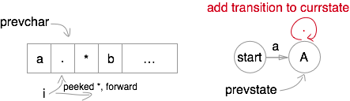

# Regular expression matching

## Description

* [Link](https://leetcode.com/problems/regular-expression-matching/)
* Input: s, type: str. String to be matched.
* Input: p, type: str. Pattern.
* Output type: bool. matched or not.

## DP

* Mark `^` in the beginning and `$` at the end.
* Let `f[m][n]` be whether `[0, m]` chars in string matches `[0, n]` chars in pattern.
* Discuss `p == *` or not.
* If `p != *`, only one case makes a match
  * previous pattern matches and the current char matches.
  * Bellman equation: `f[i][j] = f[i-1][j-1] and matches(s[i], p[j])`
* If `p == *`, three cases contributes to match
  * `ba` vs `ba*`: `f[i][j] |= f[i][j-1]` (match one).
  * `a` vs `ab*`: `f[i][j] |= f[i][j-2]` (ignore).
  * `aa` vs `a*`: `f[i][j] |= f[i-1][j-1] and matches(s[i], p[j-1])` (continue).
* Init
  * `f[0][0] = True`
  * `f[>0][0] = False`
  * `f[<0][?] = f[?][<0] = False`
* Edge case
  * `s = '^xxx$'`
  * `p = '^a*b*$'`
  * Here `f[0][2] = f[0][4] = True`, while `f[0][1] = f[0][3] = False`.
  * So `f[0][>0]` depends.

## FSA (obsolete)

* Finite state automaton (FSA)
 * `a.*b*c`
 * Any-transition: `A + . -> A`
 * None-transition: `A -> B`

* Trim states
 * `a*a*a*b*a*` -> `a*b*a*`
 * Originally need none-transition for each `X*`.
 * However, when `prevchar == currchar`, such transition can be omitted.

* Generate FSA
 * Forward peek

* Search states
 * DFS every possible transition.
 * None state in the middle is immature mismatch.
 * Finally being none-transferable to `end` state is acceptable.
 