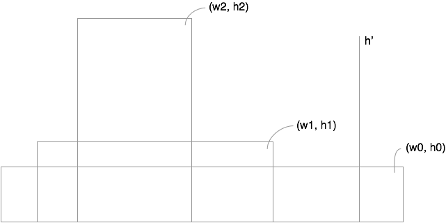

# Container with most water

## Description

* [Link](https://leetcode.com/problems/container-with-most-water/)
* Input: height, type: list[int]. Heights to be chosen from.
* Output type int. Max area.

## Solution

* Intuition: To maximize the area, either `w` or `h` should be very large.
* Greedy search strategy.
 * Start with largest `w`: start and end of possible heights.
 * Shrink `w` only if area gets larger.
* Correctness
 * The discarded border won't be useful any more.
 * Consider the shrinking process $(w_0, h_0) \rightarrow (w_1, h_1) \rightarrow (w_2, h_2)$, where $w_0 \ge w_1 \ge w_2$, $h_0 \le h_1 \le h_2$, and $w_0 h_0 \le w_1 h_1 \le w_2 h_2$.
 * __Claim__: If there were some $(w_1', h')$ with $h' \le h_2$, $w_2' \ge w_2$ appearing in the discarded area, such that $w_2' h' \ge w_2 h_2$, there could have been a larger container $(w_1', h')$ with $w_1' h' \ge w_1 h_1$.
 * __Proof__: According to the strategy, we have $w_1' - w_1 \ge w_2' - w_2$. Thus

 $$
 \frac{w_1'}{w_1} \ge \frac{w_2'}{w_2}
 \Rightarrow
 w_1' \frac{w_2}{w_2'} \ge w_1
 $$

 * (Proof cont.) According to the claim, we have $h' \ge \frac{w_2}{h_2'} h_2$. Thus

 $$
 w_1' h' \ge w_1' \frac{w_2}{w_2'} h_2 \ge w_1 h_2 \ge w_1 h_1
 $$
 
 