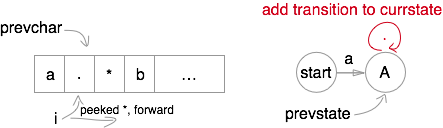

# Regular expression matching

## Description

* [Link](https://leetcode.com/problems/regular-expression-matching/)
* Input: s, type: str. String to be matched.
* Input: p, type: str. Pattern.
* Output type: bool. matched or not.

## Solution

* Finite state automaton (FSA)
 * `a.*b*c`
 * Any-transition: `A + . -> A`
 * None-transition: `A -> B`

* Trim states
 * `a*a*a*b*a*` -> `a*b*a*`
 * Originally need none-transition for each `X*`.
 * However, when `prevchar == currchar`, such transition can be omitted.

* Generate FSA
 * Forward peek

* Search states
 * DFS every possible transition.
 * None state in the middle is immature mismatch.
 * Finally being none-transferable to `end` state is acceptable.