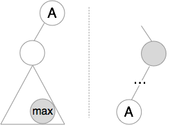
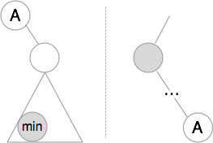

# Closest Binary Search Tree Value II

Given a non-empty binary search tree and a target value, find k values in the BST that are closest to the target.

Note:
Given target value is a floating point.
You may assume k is always valid, that is: k ≤ total nodes.
You are guaranteed to have only one unique set of k values in the BST that are closest to the target.
Follow up:
Assume that the BST is balanced, could you solve it in less than O(n) runtime (where n = total nodes)?

## Solution

* Find the closest first
* Find `k-1` predecessors and successors

* Predecessor

* Successor

## Debug

* Tricky to find `parents` of `best`.
* Tricky to stop finding `preds` or `succs` when we run out of elements.
