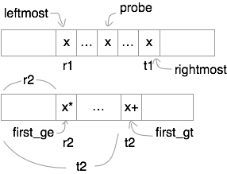

# Median of two sorted arrays

## Description
* [Link](https://leetcode.com/problems/median-of-two-sorted-arrays/)
* Input: nums1, type: list
* Input: nums2, type: list
* Return: median, type: int

## Solution

My solution is not very fast. It uses binary search, but has searched so many times. It's definitely slower than the [official solution](http://www.geeksforgeeks.org/median-of-two-sorted-arrays/), but asymptotically they should be the same.

* Generalize the problem into finding the $k$th smallest element in two sorted array.
* Guess it appears in the first array, and try to find it. If it's not found, find it in the second array.
* For the first array, use binary search to find the possible $k$th element $x$.
* For the second array, use binary search to find
 * The first element $\ge x$.
 * The first element $> x$.

* The range of rank $x$ can be is $[r_1 + r_2, t_1 + t_2]$
 * If $k < r_1 + r_2$, search left side of `nums1`
 * If $k > r_1 + r_2$, search right side of `nums1`
* Now consider the bounds for `nums2`
 * If $k < r_1 + r_2$, the next $x'$ to be searched must have $x' < x \le x^*$, so $x^*$ should still be reserved within `nums2`, but whatever after it can be safely discarded.
 * If $k > r_1 + r_2$, the next $x'$ to be searched must have $x < x'$. It is unclear if $x' \le x^+$, but it is clear that whatever on the left of $x^+$ can be safely discarded.
 * There's still tricky part to handle to handle the peripheral conditions. See code for detail.
* Finally if $k$th element is not found in `nums1`, then it must in `nums2`. Repeat this.
* Now that we can find $k$th element, we can find the median. Remember to handle the length being odd or even. 