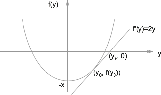

# Sqrt(x)

* Define $f(y)=y^2-x$
* Goal is to find the non-negative root of $f(y)$.

$$
\frac{y_0-y_+}{y_0^2-x} = 2 \\
y_+ = \frac{1}{2}(y_0+\frac{x}{y_0})
$$

* Init with `y=x`
* Keep iterating until `y**2 < x`
