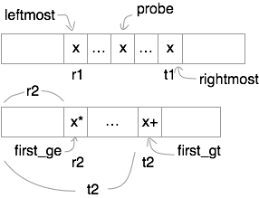

# Median of two sorted arrays

## Description
* [Link](https://leetcode.com/problems/median-of-two-sorted-arrays/)
* Input: nums1, type: list
* Input: nums2, type: list
* Return: median, type: int

## Solution: Binary Search

* [Reference](https://discuss.leetcode.com/topic/4996/share-my-o-log-min-m-n-solution-with-explanation).
* Divide `A` and `B` into left and right part

```
A[:i] | A[i:]
B[:j] | B[j:]
```

* Such that
  * Size of two parts are roughly equal: `i+j <= m+n-i-j <= i+j+1`.
  * Max of left part `<=` min of right part, i.e.
    `max(A[i-1], B[j-1]) <= min(A[i], B[j])`.
  * Edge case: define `A[-1] = B[-1] = -inf`. and `A[m] = B[n] = inf`.

* Goal is to bin-search a satisfactory `i`. `j` can be defined as
  `(m+n-2*i)//2` accordingly. In order that `0<=j<n`, we can always
  swap `A` and `B`, such that `len(A)<=len(B)`.

* It turns out that `d[i] = min(A[i], B[j]) - max(A[i-1], B[j-1])` first
  increases to `>=0`, and then decreases.
  * `d[k] < 0`, for `k` in `[0, p)`.
  * `d[k] >= 0`, for `k` in `[p, q)`.
  * `d[k] < 0`, for `k` in `[q, m+n)`.

* To decide `k` in `[0, p)` or `[q, m+n)` when `d[k] < 0`,
  we may consider the following.

* If `A[i] < B[j-1]`, `k` is in `[0, p)` and needs to move forward.

```
A      1 | 2 5 6
           ^
B  3 4 7 | 8
       ^
```

* If `B[j] < A[i-1]`, `k` is in `[q, m+n)` and needs to move backward.

```
A  1 2 5 | 6
       ^
B      3 | 4 7 8
           ^
```

* Median can be easily told if we divide `A` and `B` like this
  * If left size equals right size, mean of `max(A[i-1], B[j-1])` and
    `min(A[i], B[j])` is returned.
  * If left size is smaller, `min(A[i], B[j])` is returned.

## Solution: Elimination (Obsolete)

* Compare median of `A` and `B`.
* To many cases to discuss. Edge cases differ.

#### A is even and B is even

* If median of `A` is smaller than `B`:
  `A[m/2-1]+A[m/2] < B[n/2-1]+B[n/2]`, then the global median won't
  appear in `A[:m/2]` and `B[n/2+1:]`.
* Here's the proof for `A[:m/2]`.
  `A[m/2-1]` would at most be located at index `m/2-1+n/2-1 = (m+n)/2-2`.
  (Think about adding `n/2-1` elements to the left of `A[m/2-1]`).
  However, the global median is located at `(m+n)/2-1` and `(m+n)/2`.
* Similar analysis applies to `B[n/2+1:]`.
* Therefore, if `A[m/2-1]+A[m/2] < B[n/2-1]+B[n/2]`, we eliminate
  the left half of `A` and right half of `B`. Vice versa for
  `A[m/2] > B[n/2]`.
* If `A[m/2-1]+A[m/2] == B[n/2-1]+B[n/2]`, we simply return the mean of any.

#### A is odd and B is even

* If `A[(m-1)/2]*2 < B[n/2-1]+B[n/2]`, then the global median won't
  appear in `A[:(m-1)/2+1]` and `B[n/2:]`.
* First prove for `A[:(m-1)/2+1]`.
  `A[(m-1)/2]` would at most be located at `(m-1)/2-1+n/2 = (m+n-1)/2-1`.
  (Think about adding `n/2` elements to the left of `A[(m-1)/2]`).
  However, the global median is located at `(m+n-1)/2`.
* For `B[n/2:]`.
  `B[n/2]` would at least be located at `n/2+(m-1)/2+1 = (m+n-1)/2+1`.
  (Think about adding `(m-1)/2+1` elements to left of `B[n/2]`).
  However, the global median is located at `(m+n-1)/2`.
* Therefore, if `A[(m-1)/2]*2 < B[n/2-1]+B[n/2]`, we eliminate
  `A[:(m-1)/2+1]` and `B[n/2:]`. Otherwise we eliminate
  `A[(m-1)/2:]` and `B[:n/2]`.
* If `A[(m-1)/2]*2 == B[n/2-1]+B[n/2]`, we return `A[(m-1)/2]`. 

#### A is even and B is odd

* If `A[m/2-1]+A[m/2] < B[(n-1)/2]*2`, then the global median won't
  appear in `` and ``.
* Global median would be located at `(m+n-1)/2`.
* First prove for `A[:m/2]`.
  `A[m/2-1]` would at most be located at `m/2-1+(n-1)/2 = (m+n-1)/2-1`.
  (Think about adding `(n-1)/2` elements to the left of `A[m/2-1]`).
* For `B[(n-1)/2:]`,
  `B[(n-1)/2]` would at least be located at `(n-1)/2+m/2+1 = (m+n-1)/2+1`.
  (Think about adding `m/2+1` elements to the left of `B[(n-1)/2]`)

#### A is odd and B is odd

* If `A[(m-1)/2] < B`

## Solution: Find Kth (Obsolete)

This solution is not very fast. It uses binary search,
but has searched so many times. It's definitely slower than the
[official solution](http://www.geeksforgeeks.org/median-of-two-sorted-arrays/),
but asymptotically they should be the same.

* Generalize the problem into finding the $k$th smallest element in two sorted array.
* Guess it appears in the first array, and try to find it. If it's not found, find it in the second array.
* For the first array, use binary search to find the possible $k$th element $x$.
* For the second array, use binary search to find
 * The first element $\ge x$.
 * The first element $> x$.



* The range of rank $x$ can be is $[r_1 + r_2, t_1 + t_2]$
 * If $k < r_1 + r_2$, search left side of `nums1`
 * If $k > r_1 + r_2$, search right side of `nums1`
* Now consider the bounds for `nums2`
 * If $k < r_1 + r_2$, the next $x'$ to be searched must have $x' < x \le x^*$, so $x^*$ should still be reserved within `nums2`, but whatever after it can be safely discarded.
 * If $k > r_1 + r_2$, the next $x'$ to be searched must have $x < x'$. It is unclear if $x' \le x^+$, but it is clear that whatever on the left of $x^+$ can be safely discarded.
 * There's still tricky part to handle to handle the edge cases. See code for detail.
* Finally if $k$th element is not found in `nums1`, then it must in `nums2`. Repeat this.
* Now that we can find $k$th element, we can find the median. Remember to handle the length being odd or even. 