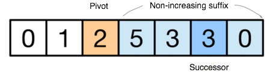

# Next Permutation

[Reference](https://discuss.leetcode.com/topic/52275/easy-python-solution-based-on-lexicographical-permutation-algorithm).

* Find pivot as the one before the non-increasing suffix.
* Find the last element that is greater than the pivot.
* Swap them, and get the new pivot.
* reverse those after the pivot.
* Edge case: monotonically non-increasing sequence.
  Solution: simply reverse it.