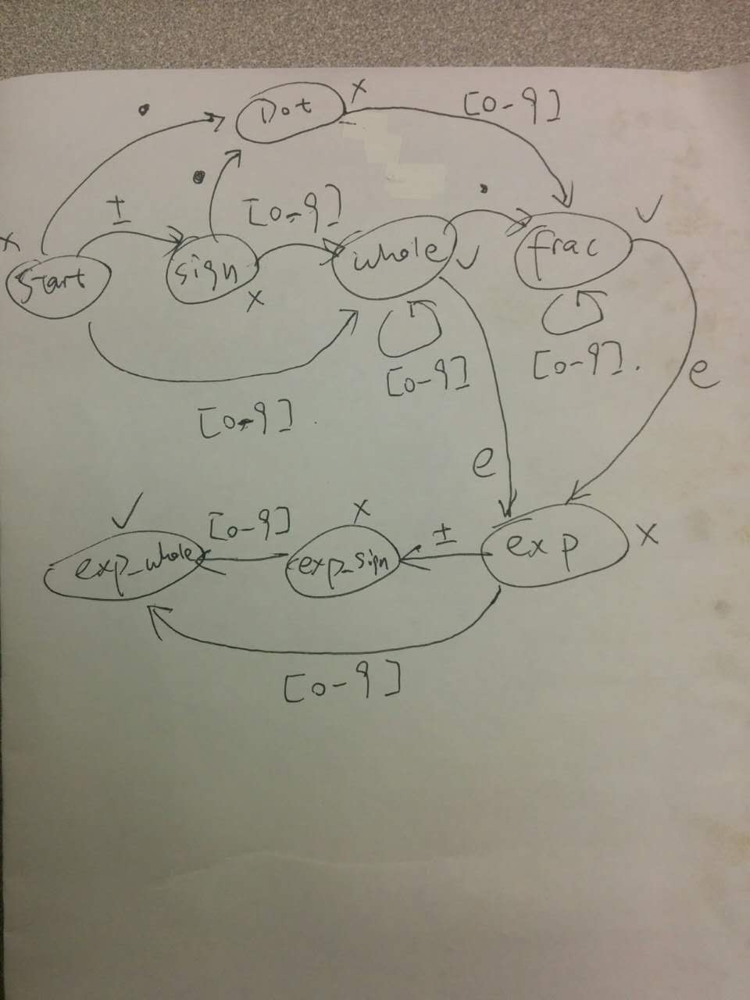

# Valid Number

https://leetcode.com/problems/valid-number/

## Definite Finite Automation

## Regular Expression

A valid number can have the following components.

* Leading spaces (optional).
* Sign (optional).
* Floating number.
* Power (optional).
* Trailing spaces (optional).

The leading / trailing spaces can be represented as ` *`. The optional sign can be represented as `[+-]?`.

The floating number can be one of the following

* `xx.xx`
* `xx.`
* `xx`
* `.xx`

`xx.xx` and `xx.` can be represented as `\d+\.\d*`. `xx` and `.xx` can be represented as `\.?\d+`. We cannot combine
these two cases because a dangling `.` is not allowed.

The power part can only contain integrals, so the entire part can be represented as `(e[+-]?\d+)?`.
