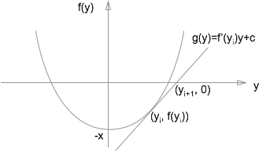

# Sqrt(x)

* Define $f(y)=y^2-x$
* Goal is to find the non-negative root of $f(y)$.

$$
\frac{-f(y_i)}{y_{i+1}-y_i} = f'(y_i) \\
$$

$$
\begin{align*}
y_{i+1} &= y_i - \frac{f(y_i)}{f'(y_i)} 
\\&= y_i - \frac{y_i^2-x}{2y_i}
\\&= \frac{1}{2}(y_i + x/y_i)
\end{align*}
$$

* Init with `y=x`
* Keep iterating until `y**2 < x`
