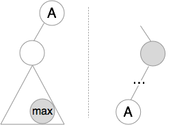
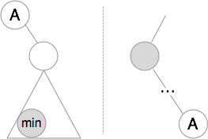

# Closest Binary Search Tree Value II

https://leetcode.com/problems/closest-binary-search-tree-value-ii/

## Solution

First, let's find the first element that is >= `target`. This element will be used as an upper bound. It could be empty.
Then let's find lower bound. If the upper bound exists, the lower bound will be its predecessor. Otherwise, the lower
bound will be the last node in the tree. Then, we keep probing the upper bound and the lower bound until we find `k`
elements.

The process requires us to find the successor and the predecessor of a given node. To do this, we also need to track the
parent nodes in a stack. The following illustrations explain how to find them.

* Successor

* Predecessor

