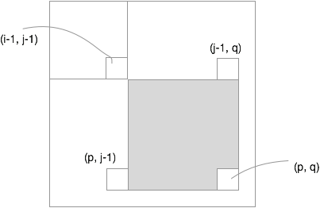
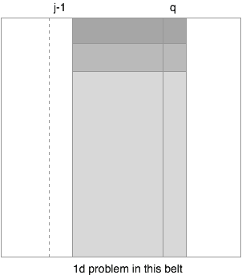

# Max Sum of Rectangle No Larger Than K

## One-dimension Problem

* Compute the prefix sums, the problem is then converted into

$$
\begin{align*}
\max_{ij} &\quad S_j - S_{i-1} \\
\text{s.t.} &\quad j \ge i \\
            &\quad S_j - S_{i-1} \le k
\end{align*}
$$

* Fixing $i$, the problem is further reduced to

$$
\begin{align*}
\max_{j} &\quad S_j \\
\text{s.t.} &\quad j \ge i \\
            &\quad S_j \le S_{i-1} + k
\end{align*}
$$

* Let $i$ go backward, and add $S_i$ to BST, $\max_j S_j$ can be found without iterating over $j$. We only need to find the last element that is $\le$ $S_{i-1}+k$ within $O(\log n)$, assuming `len(S) == n`.

## Two-dimension Problem

* Prefix sums
 * `S[p][q]-S[i-1][q]-S[p][j-1]+S[p-1][q-1]` will be the sum for the shaded area.

* Problem becomes

$$
\begin{align*}
\max_{i, j, p, q} &\quad S_{pq} - S_{i-1, q} - S_{p, j-1} + S_{i-1, j-1} \\
\text{s.t.} &\quad p \ge i,\ q \ge j. \\
            &\quad S_{pq} - S_{i-1, q} - S_{p, j-1} + S_{i-1, j-1} \le k
\end{align*}
$$

* Fixing $j, q$, the problem is then reduced to

$$
\begin{align*}
\max_{i, p} &\quad (S_{pq} - S_{p, j-1}) - (S_{i-1, q} - S_{i-1, j-1}) \\
\text{s.t.} &\quad p \ge i,\ q \ge j. \\
            &\quad S_{pq} - S_{p, j-1} \le k + S_{i-1, q} - S_{i-1, j-1}
\end{align*}
$$

* $T_p = S_{pq} - S_{p, j-1}$ can be pre-computed fixing $j, q$.

* Therefore the problem is further reduced to

$$
\begin{align*}
\max_{i, p} &\quad T_p - T_{i-1} \\
\text{s.t.} &\quad p \ge i \\
            &\quad T_p \le k + T_{i-1}
\end{align*}
$$

* This is the 1-d problem we solved just now. Let $i$ go backward, and add $S_i$ to BST, $\max_p S_p$ can be found without iterating over $p$. We only need to find the last element that is $\le$ $T_{i-1}+k$.

* Complexity
 * Loop `j` takes $O(n)$.
 * Loop `q` takes $O(n)$.
 * Now `j` and `q` are fixed; computing `T[p]` takes $O(m)$
 * Now it's reduced to 1d problem; tree search takes $O(\log m)$.

## Implementation

* Python doesn't provide BST (hey @Guido, why not support it?!?!)
* My rb tree exceeds Leetcode code size limit (what?!?! only 300 lines!)
* Final decision is to use cpp `std::set`.

### Cpp Interface

* `lower_bound(x)` returns the first element that is $\ge x$.
* `upper_bound(x)` returns the first element that is $>x$.
* We want the last element that is $\le x$, so
 * Trickly insert `-x`
 * `-lower_bound(x)` is the first element $\ge -x$
 * `lower_bound(x)` will be the last $\le x$

## Python solution

* As python doesn't support BST, we need to maintain the accumulative sum sorted and do binary search.
* Python has [bisect](https://docs.python.org/2/library/bisect.html)! No longer need to write binary search!!!
* But still maintaining the list sorted could have $O(n)$ worst case complexity, unlike $O(\log n)$ in BST.